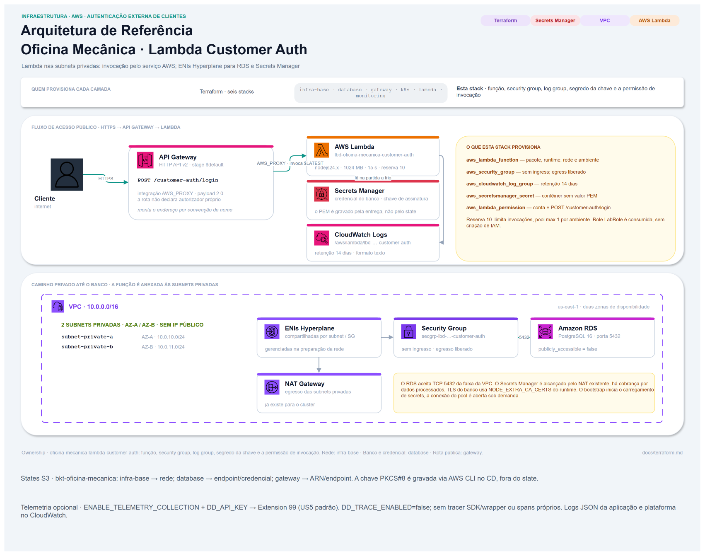

# Infraestrutura

A stack desta função vive em `infra/`, no mesmo repositório do código: o que
muda junto fica junto, e a configuração da função passa pelo mesmo ciclo de
revisão que ela.



## O que esta stack provisiona

| Recurso | Dono | Por que aqui |
| --- | --- | --- |
| Função | **este repositório** | O artefato e a sua configuração pertencem ao mesmo ciclo de revisão |
| Grupo de segurança da função | **este repositório** | Nasce e morre com a função |
| Autorização de invocação concedida ao API Gateway | **este repositório** | Sem ela a rota responde erro de integração com a função saudável — e nenhuma outra stack a declara |
| Grupo de log da função | **este repositório** | Sem declaração, a plataforma o cria com retenção indefinida |
| Contêiner do segredo da chave privada de assinatura | **este repositório** | O material é da função; o **valor** é escrito pela entrega |
| Rede, subnets, gateway de tradução | `oficina-mecanica-infra-base` | Consumido por leitura de state remoto |
| Banco, seu grupo de segurança e o segredo da credencial | `oficina-mecanica-infra-database` | Quem é dono do recurso é dono da credencial |
| API Gateway, rota e limitação de frequência | `oficina-mecanica-api-gateway` | A rota é publicada lá; esta stack apenas autoriza a invocação |
| Cluster, registro de imagens e balanceador | `oficina-mecanica-infra-k8s` | Não participa desta função |
| Bucket do state | compartilhado, pré-existente | Já existe e serve as seis stacks Terraform. **Esta acrescenta apenas uma chave** |
| Qualquer role de identidade | **ninguém** — o laboratório não permite criar roles | A role de execução é lida por fonte de dados, nunca criada |

## Estado remoto

Endereço, porta e nome do banco, identificadores de subnet e o identificador de
execução da API vêm do state das stacks que os possuem. Nada disso é digitado
como variável.

| Origem | Chave do state | O que esta stack lê |
| --- | --- | --- |
| `infra-base` | `infra/prod-simulated/infra-base/terraform.tfstate` | `vpc_id`, `private_subnet_ids` |
| `database` | `infra/prod-simulated/database/terraform.tfstate` | `db_host`, `db_port`, `db_name`, `db_credentials_secret_arn` |
| `gateway` | `infra/prod-simulated/gateway/terraform.tfstate` | `api_execution_arn`, `api_endpoint` |

## Backend

```hcl
bucket       = "bkt-oficina-mecanica"
key          = "infra/prod-simulated/lambda-customer-auth/terraform.tfstate"
region       = "us-east-1"
encrypt      = true
use_lockfile = true
```

Cifração em repouso e trava por arquivo de bloqueio no próprio armazenamento de
objetos — as mesmas opções das outras cinco stacks, sem tabela auxiliar.

O arquivo de bloqueio de provedores (`.terraform.lock.hcl`) é versionado, como
nas demais stacks da solução, e cobre `linux_amd64` — a esteira —, `windows_amd64`
e `darwin_arm64` — as estações de trabalho.

## Ordem de aplicação

```
infra-base  ──→  database  ────────────────┐
            └─→  k8s  ──→  gateway  ──────┴─→  lambda-customer-auth
```

A autorização de invocação declarada aqui restringe pelo identificador de
execução da API, lido do state remoto daquela stack: o API Gateway vem antes.

**O segredo da credencial do banco é pré-requisito, não consequência.** A stack
de banco expõe o identificador desse segredo pelo output
`db_credentials_secret_arn`. Sem ele, a leitura do state remoto reprova por
atributo inexistente e **nenhum recurso desta stack chega a ser planejado**.

## Configuração da função

| Parâmetro | Valor | Motivo |
| --- | --- | --- |
| Ambiente de execução | `nodejs24.x` | Versão de longo prazo; casa com o motor declarado pelo projeto e com o alvo da construção |
| Ponto de entrada | `handler.handler` | Arquivo único na raiz do pacote, saída da construção |
| Arquitetura | a padrão | A alternativa é ~20% mais barata e o algoritmo de hash é puro, mas mudaria o endereço da camada de coleta. Uma peça móvel a menos vale mais que a diferença |
| Memória | **1024 MB** | A memória também controla a CPU disponível; verificar senha depende de CPU. O efeito em latência e custo deve ser medido, não é proporcionalidade garantida. É valor de partida: a linha de invocação reporta a duração da verificação, e o ajuste fino se faz com esse dado |
| Tempo limite | **15 s** | O teto de integração do API Gateway é 30 s. Os limites internos somam ~8 s, então 15 s dá quase o dobro de folga e **reduz pela metade** o tempo que uma invocação pendurada retém um lugar da concorrência reservada |
| Concorrência reservada | **10**, por variável | Limita invocações simultâneas; cada ambiente usa pool `max: 1`. O orçamento inclui API, sessões administrativas e conexões ociosas — ver [Banco](database.md#orçamento-de-conexões) |
| Formato de log | **texto** | O formato estruturado da plataforma **embrulha** a saída capturada num envelope próprio, quebrando o contrato de esquema fechado |
| Retenção do grupo de log | 14 dias | Mesma do log de acesso do API Gateway |
| Publicação de versão | ligada | Publica versão imutável quando há mudança versionável. Sem alias; Gateway e gates invocam `$LATEST` sem qualificador |
| Rede | subnets privadas, grupo de segurança próprio | O banco não é publicamente acessível e aceita apenas origens da faixa da rede |

**A reserva de concorrência pode ser recusada pela conta.** A plataforma exige
que sobrem ao menos cem execuções não reservadas, e contas novas recebem cota
reduzida. Por isso o valor é variável e a fase de pré-requisitos o verifica antes
de qualquer aplicação. O caminho de contorno é `lambda_reserved_concurrency = -1`
— não reservar. **O valor nunca é zero**: reserva zero desliga a função por completo, e a variável recusa
esse valor.

O grupo de segurança não declara regra de ingresso: nada conecta na função — ela
é invocada por chamada de serviço, não por rede. O egresso é liberado, e alcança
o gerenciador de segredos e o destino de telemetria pelo gateway de tradução de
rede que já existe nas rotas privadas, sem outro NAT criado aqui; continuam existindo cobrança de processamento e
transferência de dados e custos de Secrets Manager, logs e telemetria.

## Variáveis de entrada Terraform

Os 27 inputs têm default. Role, limites e nomes devem ser confrontados com a
conta e os produtores dos states; o default não comprova disponibilidade cloud.

| Variável | Descrição | Tipo | Padrão | Uso |
| --- | --- | --- | --- | --- |
| `aws_region` | Região dos recursos | `string` | `us-east-1` | Configura AWS e compõe o ARN da layer opcional. |
| `project_name` | Nome base do projeto | `string` | `oficina-mecanica` | Compõe SG, nome do segredo de assinatura e tags. |
| `environment` | Ambiente de infraestrutura | `string` | `prod-simulated` | Aplica a tag Environment; NODE_ENV e DD_ENV continuam production. |
| `aws_base_state_bucket` | Bucket do state de rede | `string` | `bkt-oficina-mecanica` | Localiza o bucket S3 da stack consumida; não cria o bucket. |
| `aws_base_state_key` | Chave do state de rede | `string` | `infra/prod-simulated/infra-base/terraform.tfstate` | Seleciona o objeto que publica VPC e subnets privadas. |
| `aws_base_state_region` | Região do state de rede | `string` | `us-east-1` | Configura a leitura S3 do state correspondente. |
| `database_state_bucket` | Bucket do state de banco | `string` | `bkt-oficina-mecanica` | Localiza o bucket S3 da stack consumida; não cria o bucket. |
| `database_state_key` | Chave do state de banco | `string` | `infra/prod-simulated/database/terraform.tfstate` | Seleciona o objeto que publica host, porta, nome e ARN do segredo. |
| `database_state_region` | Região do state de banco | `string` | `us-east-1` | Configura a leitura S3 do state correspondente. |
| `gateway_state_bucket` | Bucket do state de gateway | `string` | `bkt-oficina-mecanica` | Localiza o bucket S3 da stack consumida; não cria o bucket. |
| `gateway_state_key` | Chave do state de gateway | `string` | `infra/prod-simulated/gateway/terraform.tfstate` | Seleciona o objeto que publica ARN de execução e endpoint público. |
| `gateway_state_region` | Região do state de gateway | `string` | `us-east-1` | Configura a leitura S3 do state correspondente. |
| `function_name` | Nome da função | `string` | `lbd-oficina-mecanica-customer-auth` | Configura a função, seu log group e a tag Name; deve coincidir com o nome configurado no gateway. |
| `lambda_execution_role_name` | Nome de role existente | `string` | `LabRole` | Resolve data.aws_iam_role.lambda_execution; esta stack não cria nem modifica sua política. |
| `lambda_runtime` | Runtime Lambda | `string` | `nodejs24.x` | Configura o runtime; precisa ser compatível com o bundle alvo node24. |
| `lambda_memory_size` | Memória em MB | `number` | `1024` | Configura memória e CPU disponíveis; medir efeito na verificação de senha. |
| `lambda_timeout` | Timeout em segundos | `number` | `15` | Limita a duração de execução da função. |
| `lambda_reserved_concurrency` | Reserva de invocações simultâneas | `number` | `10` | Controla reserved_concurrent_executions; -1 remove a reserva e 0 é recusado. |
| `log_retention_in_days` | Retenção em dias | `number` | `14` | Configura a exclusão dos logs no CloudWatch. |
| `node_extra_ca_certs` | Caminho do bundle de CAs | `string` | `/etc/pki/tls/certs/ca-bundle.crt` | Define NODE_EXTRA_CA_CERTS para verificar TLS do RDS. |
| `service_version` | Versão do serviço | `string` | `dev` | CD injeta github.sha no logger, DD_VERSION opcional e tag ServiceVersion. |
| `enable_telemetry_collection` | Habilitação da coleta | `bool` | `false` | Anexa a layer e as variáveis DD_*; não habilita tracing no código. |
| `telemetry_api_key` | Chave de ingestão, sensível | `string` | `""` | Alimenta DD_API_KEY no environment da função; permanece no state. |
| `telemetry_site` | Site Datadog | `string` | `us5.datadoghq.com` | Configura DD_SITE quando a coleta está ligada. |
| `telemetry_extension_layer_account_id` | Conta publicadora da layer | `string` | `464622532012` | Compõe o ARN da layer na região do provider. |
| `telemetry_extension_layer_name` | Nome da layer | `string` | `Datadog-Extension` | Seleciona a extensão anexada; não altera o handler. |
| `telemetry_extension_layer_version` | Versão da layer | `number` | `99` | Fixa a versão anexada quando a coleta está ligada. |

## Variáveis de ambiente da função

O esquema de configuração da aplicação **recusa a partida** quando falta
qualquer obrigatória, e a falha ocorre na composição — antes de qualquer
processamento —, de modo que **toda** invocação responderia erro interno. Por
isso a stack declara o conjunto completo, e não apenas o que a esteira injeta.

| Variável | Origem | Observação |
| --- | --- | --- |
| `NODE_ENV` | constante, `production` | **Obrigatória e sem valor padrão.** A plataforma não a define. Além de habilitar a partida, é ela que liga os guardas de produção: exigir os identificadores de segredo, recusar os valores de contorno e recusar transporte não cifrado |
| `DATABASE_HOST` | output `db_host` do state remoto | Nunca digitado |
| `DATABASE_PORT` | output `db_port` do state remoto | Nunca digitado |
| `DATABASE_NAME` | output `db_name` do state remoto | Nunca digitado |
| `DATABASE_SECRET_ID` | output `db_credentials_secret_arn` do state remoto | **Opaco por contrato** — ver abaixo |
| `CUSTOMER_JWT_PRIVATE_KEY_SECRET_ID` | recurso desta stack | Contêiner declarado aqui, valor escrito pela entrega |
| `NODE_EXTRA_CA_CERTS` | constante | Pacote de autoridades que a imagem do runtime já traz — ver [Banco de dados](database.md#transporte-cifrado) |
| `NODE_OPTIONS` | constante, `--enable-source-maps` | A construção emite o mapa; sem a opção, a pilha de uma falha interna aponta para posição no pacote em vez de arquivo de origem |
| `SERVICE_VERSION` | a entrega, `github.sha` | Alimenta o atributo `service.version` que o registro estruturado já emite |
| `DD_API_KEY`, `DD_SITE`, `DD_ENV`, `DD_SERVICE`, `DD_VERSION`, `DD_SERVERLESS_LOGS_ENABLED`, `DD_TRACE_ENABLED` | camada de coleta | Declaradas apenas com o interruptor ligado. `DD_ENV` é fixo em `production` e não acompanha `var.environment` — ver [Observabilidade](observability.md) |

Nenhum valor sensível aparece no código versionado: a credencial do banco é
resolvida em execução, a chave de assinatura também, e a credencial de telemetria
vem do secret de organização e é passada ao environment da função no Terraform.

## O contrato de output da credencial do banco

Esta stack consome o **output**, nunca um nome fixo. Três propriedades — todas
verificáveis — tornam gratuita a troca de implementação a montante, de segredo
declarado explicitamente para credencial gerenciada pelo próprio serviço de
banco:

1. **O nome do output é o contrato**, e o identificador do segredo é opaco. A
   stack de banco pode trocar o valor de `db_credentials_secret_arn` de um
   segredo declarado para o identificador de um segredo gerenciado — cujo nome é
   gerado e não pode ser escolhido — sem que nada aqui mude.
2. **A forma do conteúdo é a mesma**: campos `username` e `password`, com campos
   adicionais tolerados pelo leitor. A credencial gerenciada acrescenta campos de
   motor, endereço, porta e nome do banco; o leitor os ignora.
3. **O modelo de cifração é o mesmo**: chave gerenciada padrão do serviço de
   segredos, de modo que a permissão de decifração seja idêntica nas duas
   implementações.

Endereço, porta e nome do banco continuam vindo dos outputs que a stack de banco
já expõe, e **não** do segredo — assim a origem desses três não muda junto.

No plano de execução, a promessa é fechada pelo descarte da composição memoizada
quando o banco recusa autenticação: a invocação seguinte relê o segredo, e um
ambiente já aquecido não fica inutilizável até ser reciclado.

## A chave privada não transita pelo state

O contêiner do segredo é declarado aqui; o **valor** é escrito pela entrega, de
forma idempotente, com identificador de requisição derivado do resumo
criptográfico do material.

Declarar o valor na infraestrutura o colocaria em texto puro no state, num bucket
compartilhado pelas seis stacks Terraform. Quem tem a chave privada emite token para
qualquer cliente: é o material mais sensível da solução.

É uma divergência deliberada da postura da stack de banco quanto à senha do
banco, e o custo é que um ambiente novo só fica funcional depois de a entrega
executar — o que ela faz de qualquer forma.

## O artefato

O arquivo compactado é montado por `archive_file` sobre `app/dist`, no momento da
aplicação: uma única fonte de verdade para o conteúdo e para o identificador de
conteúdo. A fonte de dados normaliza carimbos de tempo, então o identificador
deriva do conteúdo e um commit inalterado não produz diferença na prévia.

`output_file_mode` é declarado explicitamente porque a normalização **não**
cobre permissões de arquivo, que entram no arquivo compactado e diferem entre
sistemas operacionais.

## Como Executar Localmente

```bash
# A partir da raiz do clone, entrar na stack
cd infra
# Conferir formatação e instalar os schemas sem acessar o backend
terraform fmt -check -recursive
terraform init -backend=false
# Validar a configuração; não executa fontes de dados ou chamadas AWS
terraform validate
```

Os três não exigem credenciais: fontes de dados não são avaliadas nessas etapas.

Para uma prévia é preciso o laboratório ligado, credenciais válidas e o pacote
construído — a configuração declara uma fonte de dados sobre `app/dist`:

```bash
# A partir da raiz do clone, construir o artefato exigido pelo archive_file
cd app
npm ci
npm run build
# Usar credenciais AWS válidas e os três states já aplicados
cd ../infra
terraform init -reconfigure
# Revisar o plano, sem criar recursos
terraform plan
```

Uma prévia executada em sistema operacional diferente do da esteira pode acusar
diferença no identificador de conteúdo do pacote sem mudança de código — ver
[CI/CD › Solução de problemas](ci-cd.md#solução-de-problemas).

## Outputs

| Output | Descrição | Uso |
| --- | --- | --- |
| `function_name` | Nome da função | CD publica como output de job e o gate direto usa em aws lambda invoke; gateway configura seu nome separadamente. |
| `function_arn` | ARN da função | Identificação operacional; nenhuma outra stack lê automaticamente. |
| `function_invoke_arn` | URI de invocação | Referência operacional; gateway monta seu próprio URI por convenção. |
| `function_version` | Última versão numerada publicada | CD registra no resumo; gates e gateway não a usam como qualificador. |
| `jwt_private_key_secret_arn` | ARN do contêiner da chave privada | CD lê para gravar o PEM fora do state; não expõe o material. |
| `log_group_name` | Nome do grupo CloudWatch | Consulta operacional de logs; não é output de job no CD atual. |
| `api_endpoint` | Endpoint público lido do gateway | CD repassa ao post-deploy-gates, que chama /customer-auth/login. |

Nenhuma outra stack lê os outputs da Lambda via remote state. Ainda assim,
removê-la interrompe `POST /customer-auth/login`: o Gateway monta o URI por
convenção de nome e não remove a rota automaticamente.

## Aplicação, chave de assinatura e remoção

Pré-requisitos de nuvem:

- Infra-base, database, Kubernetes e gateway aplicados, na ordem do grafo acima.
- Schema da API migrado no RDS; esta função não executa migrations.
- AWS CLI, Terraform ≥ 1.11 e credenciais de sessão Academy válidas.
- Role existente (`LabRole` por padrão), com trust Lambda, acesso aos dois
  segredos, gestão das ENIs e escrita no CloudWatch. Não criar roles aqui.
- Par RSA preparado: chave privada no environment `production` da Lambda
  e chave pública correspondente configurada na API.

O CD é o roteiro completo: constrói, aplica, grava a chave idempotentemente
e executa os dois gates. Um `terraform apply` local cria somente o contêiner
do segredo; não grava o PEM, e a função só fica utilizável depois dessa escrita.

```bash
# Após construir app/dist, autenticar a sessão e revisar terraform plan
terraform apply
# Conferir os identificadores; nenhuma saída contém a chave privada
terraform output function_name
terraform output jwt_private_key_secret_arn
# Preferir o CD para gravar a chave e executar os gates de implantação
```

Para remover o lab, remova a Lambda antes de gateway, database e infra-base:

```bash
# Na pasta infra da Lambda, revisar os recursos que serão removidos
terraform plan -destroy
# A remoção interrompe o login e exclui imediatamente o segredo da chave
terraform destroy
```

Mantenha a chave privada sob custódia fora do lab para a reconstrução. A
remoção do banco apaga os dados; o roteiro completo está na
[arquitetura do gateway](https://github.com/FIAP-15SOAT/oficina-mecanica-api-gateway/blob/main/docs/architecture.md#ordem-de-aplicação-e-de-rollback).

## Documentação relacionada

- [CI/CD](ci-cd.md) — build, gravação da chave, gates e configuração GitHub.
- [Arquitetura](architecture.md) — camadas e execução na VPC.
- [Banco](database.md) — consulta, TLS e orçamento de conexões.
- [Segurança](security.md) — custódia e proteção do material de assinatura.
